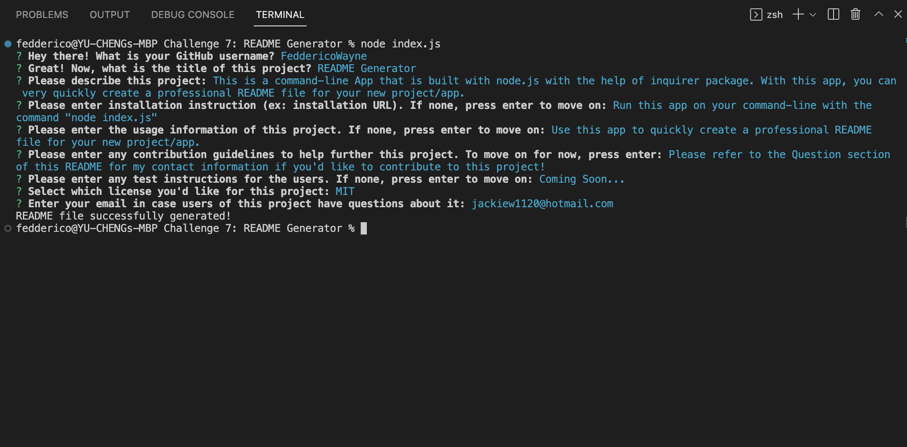
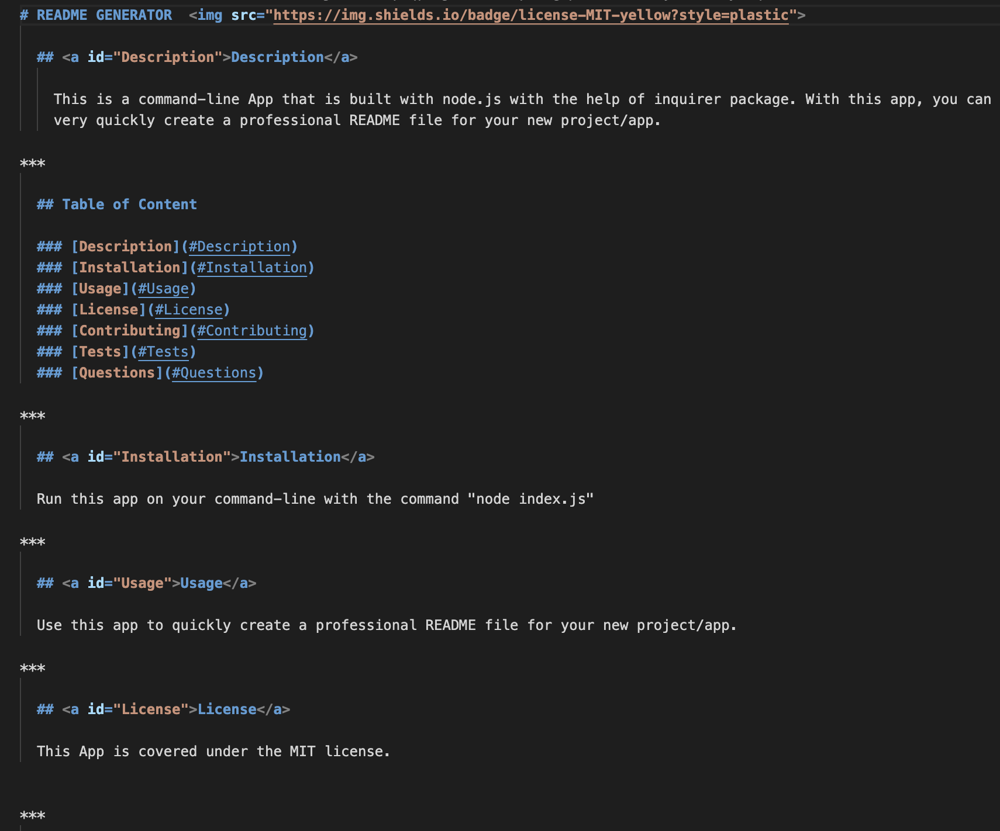
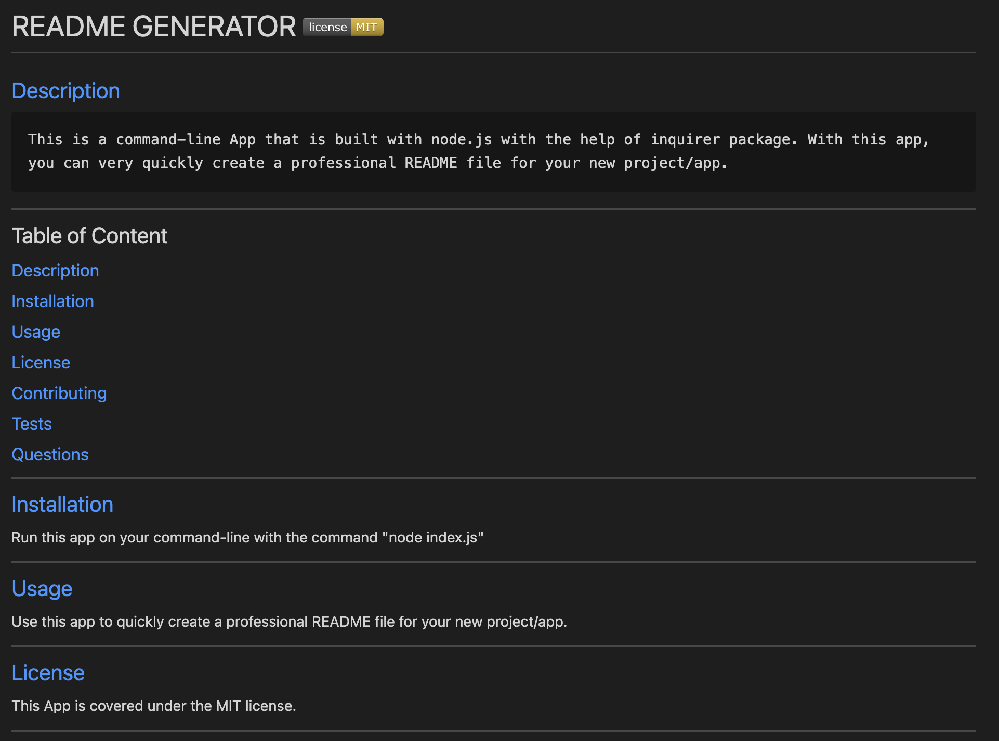

# README GENERATOR  

  ## [Description](#Description)

    This is a command-line App that is built with node.js with the help of inquirer package. With this app, you can very quickly create a professional README file for your new project/app.
  
  Command-line screenshot:
  
  Generated README file screenshot:
  
  README file in Preview:
  

***

  ## Table of Content

  ### <a id="Description">Description</a> 
  ### <a id="Installation">Installation</a> 
  ### <a id="Usage">Usage</a>
  ### <a id="License">License</a>
  ### <a id="Contributing">Contributing</a>
  ### <a id="Tests">Tests</a>
  ### <a id="Questions">Questions</a>

***

  ## [Installation](#Installation)

  Run this app on your command-line with the command "node index.js"

***

  ## [Usage](#Usage)

  Use this app to quickly create a professional README file for your new project/app.

***

  ## [License](#License)
  
  This App is covered under the MIT license.

  
***

  ## [Contributing](#Contributing)

  Please refer to the Question section of this README for my contact information if you'd like to contribute to this project!

***

  ## [Tests](#Tests)

  Coming Soon...

***

  ## [Questions](#Questions)

  For more info on my work, please check out my GitHub page at: https://github.com/feddericowayne
  
  Should you have any further questions regarding this App, please don't hesitate to reach out to me via email at: <a href="mailto:jackiew1120@hotmail.com">jackiew1120@hotmail.com</a>

  
